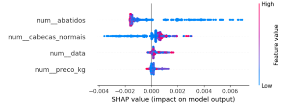

# End-to-End Meat Inspection Analytics Platform
> An end-to-end Data Science and Business Analytics solution for swine slaughter inspection, sanitary condemnation analysis, and risk-based decision support.

## Project Overview

Food safety, animal health, and public health are deeply interconnected. Slaughterhouses represent a critical control point between primary animal production and the final consumer, where sanitary inspections help prevent unsafe meat from entering the food chain.

In Portugal, official veterinary services collect large volumes of operational, sanitary, traceability, production, and economic data related to swine slaughter activity. However, transforming these fragmented and heterogeneous datasets into actionable insights remains a major analytical challenge.

This project simulates a data consulting engagement for the Portuguese Directorate-General for Food and Veterinary Affairs (DGAV). It focuses on swine slaughter inspection in mainland Portugal between 2011 and 2024 and addresses the following strategic question:

> **Can slaughter inspection data be transformed into a reliable analytical and predictive tool for sanitary surveillance and data-driven decision-making?**

The solution covers the complete data lifecycle, combining a **Medallion Architecture in Microsoft Fabric**, dimensional and semantic modelling, Power BI analytics, data quality assessment, and Machine Learning. Its purpose is to explore how data can support a more proactive and risk-based sanitary inspection model.

## Project Scope & Objectives
The project focuses on five main analytical and technical objectives:

- **Slaughter Activity & Logistics:** Analyze slaughter volumes, regional and temporal patterns, and operational flows across mainland Portugal.
- **Sanitary Condemnation Analysis:** Evaluate condemnation rates, identify the main causes of carcass rejection, and assess their epidemiological value.
- **Data Quality & Traceability:** Identify inconsistencies, traceability gaps, and data reliability issues across operational information systems.
- **Economic Impact Analysis:** Explore the relationship between slaughter activity, sanitary indicators, and pork market prices, while estimating the financial impact of condemned carcasses.
- **Predictive Risk Analysis:** Develop Machine Learning models to assess the feasibility of predicting condemnation rates and identify factors associated with higher sanitary risk.

## Data Sources & Integration

The project integrates heterogeneous datasets from official Portuguese animal health, food safety, agricultural, and market information systems, covering operational, sanitary, geographical, traceability, production, and economic aspects of the swine production and slaughter lifecycle.

### Main Data Sources

| Data Domain | Source | Main Information |
|---|---|---|
| Animal Holdings | SISS | Holding characteristics, production type, farming system, geographic coordinates, and official holding identifiers |
| Slaughter Activity | Trichinella Inspection Records | Number of slaughtered pigs, slaughterhouse, slaughter date, and holding of origin |
| Sanitary Condemnations | SIPACE Inspection Records | Post-mortem condemnation events and reasons for carcass rejection |
| Production Characteristics | DES | Herd size, animal categories, production cycle, farming system, and standardized livestock indicators |
| Slaughterhouse Operations | IS Ungulates Indicators | Slaughterhouse activity, weekly slaughter volumes, location, and operational specialization |
| Pork Market Prices | GPP Agricultural Market Information System | Weekly regional pork carcass prices between 2011 and 2024 |
| Reference & Mapping Tables | DGAV Auxiliary Tables | Standardization of condemnation reasons and mapping of animal holding identifiers |

### Data Integration Challenges

The source datasets were produced by different operational systems and administrative services, resulting in differences in structure, granularity, nomenclature, and identifier standards.

The main integration challenges included:

- Different temporal granularities across source systems.
- Inconsistent animal holding identifiers.
- Free-text fields in legacy inspection records.
- Changes in nomenclature between SIPACE and +SIPACE.
- Geographic alignment between holdings and slaughterhouses.
- Integration of sanitary, productive, operational, and economic data.

### Source Data Centralization

All source files were centralized in a dedicated Microsoft Fabric Lakehouse, `lh_dsp10_source`, which preserves the original raw files before processing.

This source layer feeds a second Lakehouse dedicated to the Bronze, Silver, and Gold layers of the Medallion Architecture.

The integration process connects the main stages of the analytical lifecycle:

> **Animal Origin → Production Characteristics → Slaughter Activity → Sanitary Inspection → Condemnation Outcome → Economic Context**

## Solution Architecture

The solution was implemented in **Microsoft Fabric** as an end-to-end data and analytics platform, covering the complete lifecycle from raw data ingestion to Business Intelligence and predictive modelling.

The architecture combines:

- A dedicated source Lakehouse for raw file preservation.
- Automated PySpark notebook pipelines.
- Bronze, Silver, and Gold layers based on the Medallion Architecture.
- A Kimball dimensional model and centralized tabular semantic model.
- Power BI dashboards and a Machine Learning pipeline.

This design simulates a modern enterprise data environment by separating source storage, data processing, analytical modelling, and consumption layers.

┌───────────────────────────────────────────────┐
│                 DATA SOURCES                  │
│ SISS │ Trichinella │ SIPACE │ DES │ IS │ GPP │
└────────────────────────┬──────────────────────┘
                         │
                         ▼
              ┌─────────────────────┐
              │   Source Lakehouse  │
              │  lh_dsp10_source    │
              │      Raw Files      │
              └──────────┬──────────┘
                         │
                         ▼
              ┌─────────────────────┐
              │ Automated Pipelines │
              │ PySpark Notebooks   │
              └──────────┬──────────┘
                         │
                         ▼
        ┌────────────────────────────────┐
        │      MEDALLION ARCHITECTURE    │
        │                                │
        │  BRONZE → SILVER → GOLD        │
        └───────────────┬────────────────┘
                        │
              ┌─────────┴─────────┐
              ▼                   ▼
     ┌─────────────────┐   ┌─────────────────┐
     │ Dimensional     │   │ Machine Learning│
     │ Model           │   │ Pipeline        │
     └────────┬────────┘   └─────────────────┘
              │
              ▼
     ┌─────────────────┐
     │ Tabular Semantic│
     │ Model           │
     └────────┬────────┘
              │
              ▼
     ┌─────────────────┐
     │ Power BI Reports│
     │ & Dashboards    │
     └─────────────────┘

## Data Architecture

The data platform follows a **Medallion Architecture**, separating raw ingestion, data quality processing, and business-ready analytical modelling into Bronze, Silver, and Gold layers.

### Bronze Layer — Raw Data Ingestion

The Bronze layer ingests source files into Delta tables while preserving their original structure and granularity.

Its main responsibilities are:

- Preserve source data for traceability and auditability.
- Standardize file-based sources into Delta format.
- Add source and ingestion metadata.
- Support incremental and idempotent loading.

### Silver Layer — Data Cleaning and Standardization

The Silver layer transforms the raw datasets into consistent and reliable analytical entities.

Main transformations include:

- Data type and date standardization.
- Missing value treatment and deduplication.
- Standardization of animal holding identifiers.
- Reconciliation of records between legacy and current systems.
- Geographic and operational enrichment.
- Harmonization of condemnation reason nomenclature.
- Data quality and traceability validation.

> [!IMPORTANT]
> **Data Engineering Challenge**
>
> Approximately **190 heterogeneous condemnation descriptions** were harmonized into **22 standardized sanitary categories**. The integration process also addressed free-text identifiers, legacy nomenclature, and inconsistencies in animal holding traceability.

### Gold Layer — Business-Ready Data

The Gold layer organizes curated data into fact and dimension tables designed for reporting and predictive analysis.

It supports:

- Slaughter activity and condemnation analysis.
- Regional and transportation analysis.
- Animal holding and slaughterhouse profiling.
- Economic impact assessment.
- Power BI semantic modelling.
- Machine Learning feature preparation.

## Dimensional Model & Star Schema
To support consistent, scalable, and business-oriented analytics, the project adopts a **Kimball dimensional modelling approach**.

The analytical model was structured around fact tables, which store quantitative business metrics, and dimension tables, which provide the descriptive context required for filtering, segmentation, and multidimensional analysis.

### Business Process & Bus matrix

A **Bus Matrix** was used during the modelling process to identify the main business processes and define the conformed dimensions shared across the analytical model.

The dimensional design focuses on two main business processes:

- **Sanitary Inspection Controls**, supporting the analysis of slaughter activity, tested animals, condemned animals, and condemnation rates.
- **Condemnation Events**, providing a more detailed view of the specific reasons associated with carcass rejection for human consumption.

These business processes are represented by two main fact tables:

- `Fact_controlo_sanitario`
- `Fact_reprovacoes`
  
### Fact Tables

#### `Fact_controlo_sanitario`

Stores the main metrics associated with slaughter and sanitary inspection activity, including:

- Number of animals tested.
- Number of condemned animals.
- Sanitary condemnation rate.
- Estimated value of slaughtered carcasses.
- Estimated financial impact of condemnations.

The table connects these measures to time, animal holding, slaughterhouse, and geographic dimensions. Regional pork market prices were incorporated to support the economic impact calculations.

#### `Fact_reprovacoes`

Stores detailed condemnation events and enables analysis by:

- Date.
- Animal holding.
- Slaughterhouse.
- Original condemnation reason.
- Standardized sanitary category.
- Geographic context.

### Dimension Tables

The dimensional model includes the following main dimensions:

| Dimension | Analytical Purpose |
|---|---|
| `Dim_date` | Supports analysis by day, week, month, quarter, and year |
| `Dim_exploracao_scd` | Describes animal holdings and preserves historical changes in production characteristics |
| `Dim_matadouro` | Contains slaughterhouse identification and operational information |
| `Dim_motivorejeicao` | Structures original condemnation reasons and standardized sanitary categories |
| `Dim_exp_geografia` | Supports geographic analysis of animal holdings |
| `Dim_mat_geografia` | Supports independent geographic analysis of slaughterhouses |

### Slowly Changing Dimension Type 2

The `Dim_exploracao_scd` dimension was modelled using **SCD Type 2** to preserve historical changes in animal holding characteristics, including herd size, production type, production cycle, and farming system.

Instead of overwriting previous values, the model creates a new version of the holding whenever a relevant attribute changes.

A surrogate key identifies each historical version, while validity fields define when each record was active. This ensures that slaughter and condemnation events are analyzed using the holding characteristics that were valid at the time of the event.

> [!NOTE]
> **Historical Traceability**
>
> SCD Type 2 preserves the correct historical context for Business Intelligence and Machine Learning analysis.

### Geographic Dimension Design

Separate geographic dimensions were created for animal holdings and slaughterhouses.

Although they share similar administrative attributes, they represent different business contexts. This enables independent analysis of animal origin, slaughterhouse location, and transportation flows between production and processing regions.

### Condemnation Reason Dimension

The `Dim_motivorejeicao` dimension provides a standardized analytical structure for sanitary condemnation reasons.

It preserves the original rejection description while connecting it to a harmonized reason and a broader sanitary category. This enables both detailed diagnostic analysis and aggregated reporting across approximately 190 heterogeneous source descriptions grouped into 22 standardized categories.

## Data Pipeline & Orchestration

The data processing workflow was implemented in **Microsoft Fabric** using PySpark notebooks, Delta Lake tables, and automated orchestration pipelines.

Separate pipelines were created for each main processing stage:

- `Master_Bronze_Ingestion`
- `Master_Silver_Data`
- `Master_Dimension_Tables`
- `Master_Fact_Tables`

A central **Master Orchestrator** coordinates these pipelines in the correct execution order:

> **Bronze Ingestion → Silver Processing → Gold Dimensions → Gold Facts**

Silver transformations are executed in parallel whenever dependencies allow, while Gold dimension tables are processed before fact tables in order to preserve referential integrity.

### Load Modes

The orchestration pipeline supports two execution modes:

- **Incremental Load:** processes only new source files, avoiding duplication and unnecessary reprocessing.
- **Full Load:** rebuilds the Bronze layer when historical files, ingestion logic, schemas, or business rules change.

### Monitoring & Auditability

Each orchestrated execution receives a unique `run_id`, which is propagated across pipelines and notebooks.

Execution metadata is stored in the `pipeline_audit_log` table, enabling traceability and monitoring across the full orchestration workflow. Logged information includes:

- Processing layer and notebook.
- Target table.
- Execution status.
- Total processed rows.
- Rows added, updated, and deleted.

> [!NOTE]
> The Machine Learning preparation workflow was kept separate from the operational orchestration pipeline because it supports a distinct analytical process and is not required for Power BI refreshes.

## Semantic Model

A centralized **tabular semantic model** was developed using a Tabular Project in Visual Studio, providing a governed analytical layer between the Gold tables and Power BI.

The model integrates the fact and dimension tables defined in the Star Schema and centralizes relationships, business logic, measures, and analytical metadata.

Key modelling components include:

- Relationships between fact and dimension tables.
- Business-friendly table, column, and measure names.
- Temporal and geographic hierarchies.
- Reusable DAX measures and KPIs.
- Calculation groups for standardized analytical calculations.
- Perspectives focused on financial and data quality analysis.
- Security roles for different user profiles.
- Time-based partitions to optimize processing and refresh performance.

### Analytical Measures

The semantic model centralizes operational, sanitary, financial, and data quality metrics, including:

- Slaughter volume.
- Number of condemned animals.
- Sanitary condemnation rate.
- Estimated financial loss.
- Traceability and data completeness indicators.
- Detailed metrics by condemnation reason and sanitary category.

### Security & Model Optimization

Different access roles were created to support data governance and confidentiality.

A restricted consultancy role uses **Object-Level Security** to prevent access to detailed animal holding and holding geography information, while still allowing aggregated slaughterhouse-level analysis.

Perspectives simplify model navigation for specific analytical contexts, while time-based partitions improve processing and refresh performance for large fact tables.

> [!IMPORTANT]
> Centralizing business logic in the semantic model ensures consistent metric definitions across Power BI reports and reduces duplicated calculations across report pages.

## Power BI Analytics

An interactive Power BI report was developed to provide a 360-degree view of swine slaughter inspection activity and support operational, sanitary, financial, and data quality analysis.

The report follows a top-down navigation structure and is organized into five analytical areas:

- **Slaughterhouses:** slaughter volumes, sanitary performance, regional distribution, and operational comparison between establishments.
- **Animal Holdings:** production characteristics, geographic origin, farming systems, and transportation relationships.
- **Condemnation Reasons:** analysis of rejection causes, sanitary categories, temporal patterns, and regional distribution.
- **Financial Performance:** estimated production value, financial efficiency, pork price trends, and losses associated with condemned carcasses.
- **Data Quality & Audit:** traceability gaps, missing origin information, unavailable market prices, and data completeness indicators.

Global filters allow users to maintain the same analytical context across the report, while hierarchies and drill-down functionality support navigation between different geographic and temporal levels.

The solution also includes bookmarks, a mobile layout, and publication through a Power BI App to separate the development environment from the report distribution layer.

### Dashboard Preview

The following report pages illustrate the operational, financial, and data quality perspectives developed in Power BI.

  

  

  

### Key BI Findings

The analytical report highlighted:

- Significant regional differences in slaughter volumes, condemnation rates, and sanitary inspection activity.
- Operational differences between slaughterhouses in terms of processing volume, specialization, and geographic coverage.
- Financial sensitivity to changes in regional pork market prices and the economic impact of condemned carcasses.
- Relevant traceability, missing-origin, and data completeness gaps across the source systems.

## Machine Learning

The Machine Learning component evaluates whether historical operational, production, and inspection data can be used to predict sanitary condemnation rates before slaughter.

The problem was formulated as a **supervised regression task**, where the target variable represents the proportion of condemned animals within a slaughter control period.

### Modelling Workflow

The predictive workflow included:

- Construction of a dedicated analytical dataset from Silver and Gold tables.
- Integration of temporal, production, geographic, operational, and economic features.
- Exploratory data analysis and target distribution assessment.
- Monthly aggregation to reduce sparsity and improve modelling consistency.
- Time-based train and test split.
- Missing value treatment, outlier analysis, and feature engineering.
- Comparison of multiple regression algorithms.
- XGBoost optimization and feature selection.
- Model interpretation using SHAP values.

Several regression models were evaluated, with **XGBoost** selected for further optimization and interpretability analysis based on its comparative performance.

### Model Evaluation

Model performance was evaluated using:

- Mean Absolute Error (MAE).
- Root Mean Squared Error (RMSE).
- Coefficient of Determination (R²).

SHAP values were used to identify the variables with the greatest influence on predictions and improve model transparency.

### Model Results

  

  

### Main Finding

Despite model optimization, predictive performance remained limited.

The results suggest that the available operational variables describe the consequences of sanitary problems more effectively than their underlying causes. Variables such as slaughterhouse, animal holding, slaughter volume, seasonality, and economic context were not sufficient to reliably anticipate sanitary risk.

> [!IMPORTANT]
> **Predictive Limitation**
>
> Improving prediction would require additional variables more directly related to animal health and welfare, such as disease history, veterinary treatments, transport duration, environmental conditions, mortality indicators, and epidemiological events.

### Practical Value

Although the final model was not suitable for production deployment, the Machine Learning workflow demonstrated the technical feasibility of predictive sanitary analysis and identified the main data gaps that must be addressed before implementing a reliable risk-based inspection model.

## Key Outcomes & Limitations

The project demonstrated the value of integrating sanitary, operational, geographic, production, and economic data within a unified analytical platform.

Key outcomes include:

- Identification of regional differences in slaughter activity and sanitary performance.
- Standardization of fragmented condemnation reason records into consistent analytical categories.
- Development of financial indicators to estimate the economic impact of condemned carcasses.
- Identification of traceability and data quality gaps across operational systems.
- Validation of the technical feasibility of building a predictive condemnation-rate workflow.

The predictive analysis also showed that model performance is constrained by the limited availability of direct sanitary, environmental, and transportation risk variables.

The solution should therefore be viewed as a **decision-support prototype and analytical foundation for future development**, rather than as a production-ready sanitary risk system.

## Tech Stack

| Area | Technologies |
|---|---|
| Data Platform | Microsoft Fabric, Lakehouse, Delta Lake |
| Data Engineering | Python, PySpark, Pandas, Spark SQL |
| Orchestration | Microsoft Fabric Data Pipelines |
| Data Modelling | Kimball Methodology, Star Schema, SCD Type 2 |
| Semantic Modelling | Visual Studio Tabular Project, DAX |
| Business Intelligence | Power BI |
| Machine Learning | Scikit-learn, XGBoost, SHAP |
| Version Control | Git, GitHub |

## Repository Structure

machine-learning/
├── README.md
├── limitations-and-future-work.md
└── results/

notebooks/
├── README.md
├── data-engineering/
│   ├── bronze/
│   ├── silver/
│   └── gold/
└── machine-learning/
    ├── README.md
    └── Nb_ML_Taxa_Reprovacao

pipelines/
├── README.md
├── pipeline-master-orchestrator.png
├── pipeline-audit-table.png
└── architecture-execution-flow.png

powerbi/
├── README.md
├── executive-dashboard.png
├── financial-performance.png
├── data-quality-and-audit.png
├── condemnation-reasons.png
└── slaughterhouse.png

semantic-model/
├── README.md
├── calculation-groups.dax
├── key-measures.dax
├── security-and-partitions.md
├── semantic-model-detail.png
└── semantic-model-overview.png

README.md

## Data Privacy

The original datasets used in this project contain sensitive operational and traceability information and are therefore not publicly available.

This repository contains project documentation, architecture diagrams, selected code examples, and anonymized or synthetic samples where appropriate.

No confidential data, credentials, personal information, or identifiable animal holding records are included.

> [!NOTE]
> This project was developed for academic purposes as a simulated consulting engagement and does not represent an official DGAV production system.

## Authors

Final project developed as part of the Postgraduate Program in Data Science & Business Analytics.

## Final Remarks

This project demonstrates how Data Engineering, dimensional and semantic modelling, Business Intelligence, and Machine Learning can be integrated into a single end-to-end analytical solution.

The platform provides a unified view of swine slaughter activity, sanitary condemnation patterns, economic impact, traceability, and data quality. It also demonstrates the technical feasibility of predictive sanitary analysis, while highlighting the need for additional health, environmental, and transport-related variables before a reliable production model can be developed.

Overall, the project should be viewed as a decision-support prototype and a foundation for future risk-based sanitary inspection initiatives.
