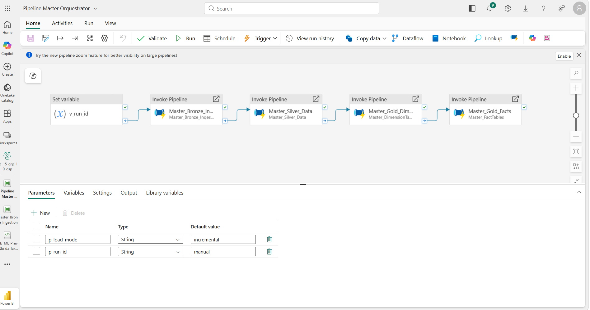
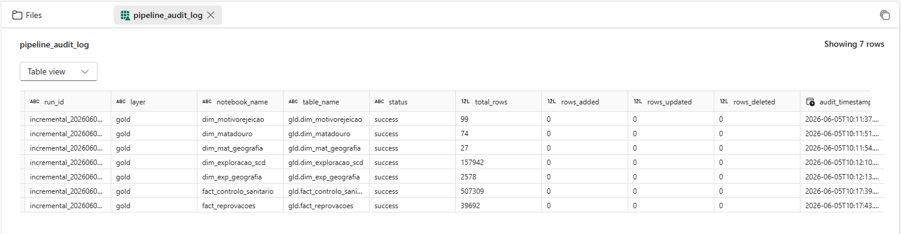

# Pipeline Orchestration

This folder documents the Microsoft Fabric pipelines used to orchestrate the Medallion Architecture.

The workflow is coordinated by a central **Master Orchestrator**, which invokes the main processing pipelines in the following order:

> **Bronze Ingestion → Silver Processing → Gold Dimensions → Gold Facts**

The orchestration design ensures that:

- Independent Silver transformations can run in parallel.
- Gold dimensions are processed before fact tables.
- Referential integrity is preserved.
- The complete analytical layer is refreshed in a controlled sequence.

## Load Modes

The Master Orchestrator supports two execution modes through the `p_load_mode` parameter:

- **Incremental Load:** processes only source files that have not yet been ingested.
- **Full Load:** rebuilds the Bronze layer and reprocesses the complete historical dataset.

The incremental process uses a control log to avoid duplicate ingestion, while the full-load option supports changes to ingestion logic, schemas, historical files, or business rules.

## Execution Tracking & Auditability

Each orchestrated execution receives a unique `run_id`, which is propagated across pipelines and notebooks.

Execution metadata is stored in the `pipeline_audit_log` table, including:

- Pipeline run identifier.
- Processing layer.
- Notebook and target table.
- Execution status.
- Total processed rows.
- Rows added, updated, and deleted.

This audit mechanism supports operational monitoring, troubleshooting, and historical analysis of pipeline executions.

> [!NOTE]
> The Machine Learning workflow was intentionally kept outside the operational Master Orchestrator because it supports a separate analytical process and is not required for Power BI refreshes.

## Pipeline Screenshots

### Master Orchestrator

  

### Audit Log

  

